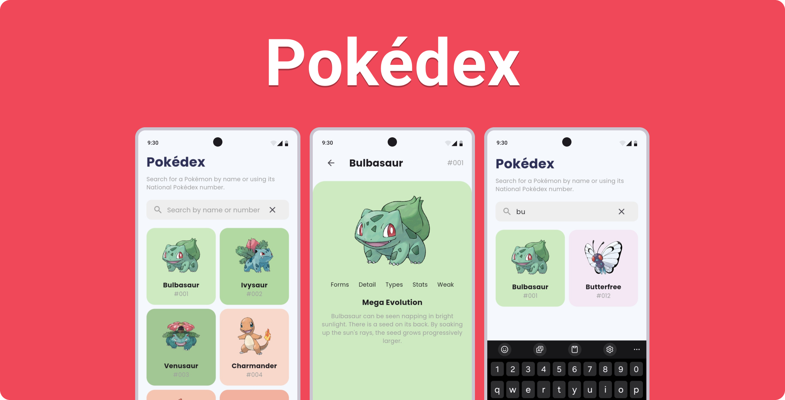

# Pokédex

Full-stack Pokédex app built with Flutter, Golang, and MongoDB. Mainly targeted for Android and iOS devices.

## Features

- Search for Pokémon by name or ID
- View Pokémons in a grid view
- View Pokémon details

## Planned Features

- Add Pokémon to favorites
- Filter
  - Pokémon by type
  - Pokémon by generation
  - Pokémon by region
  - Pokémon by moves
  - Pokémon by stat
- Admin panel
  - Add Pokémon
  - Edit Pokémon
  - Delete Pokémon

## Screenshots

