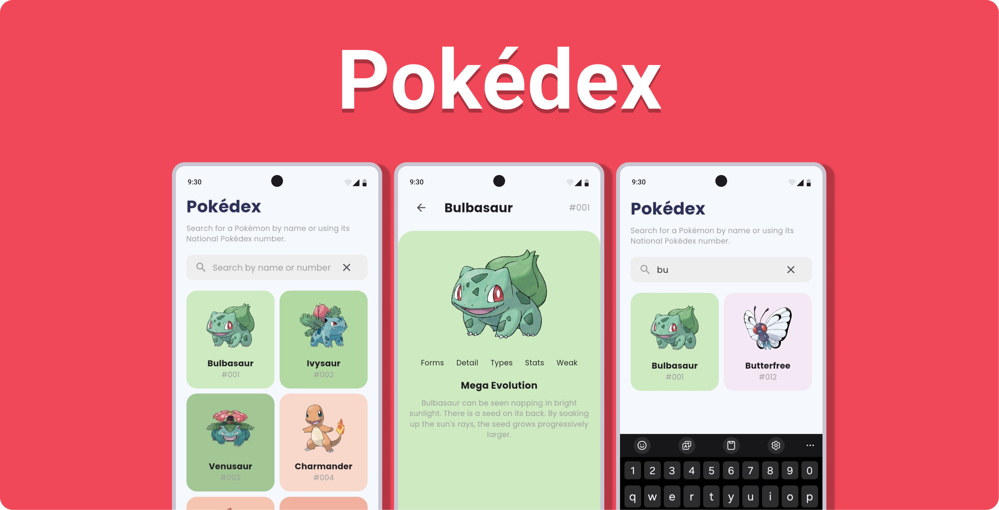

# Pokédex

Full-stack Pokédex app built with Flutter, Golang, and MongoDB. Pokémon data is managed with the admin panel built with Next.js. Check the [API documentation](https://tomlin7.github.io/pokedex/) to learn more about self-hosting the API.

## Features

- Search for Pokémon by name or ID
- View Pokémons in a grid view
- View Pokémon details
- Admin panel to manage Pokémon data
  - Add new Pokémon
  - Edit Pokémon
  - Delete Pokémon

## Planned Features

- Add Pokémon to favorites
- Filter
  - Pokémon by type
  - Pokémon by generation
  - Pokémon by region
  - Pokémon by moves
  - Pokémon by stats

## Screenshots

## Contributing

Pull requests are welcome. For major changes, please open an issue first to discuss what you would like to change. Please check the [figma design](https://www.figma.com/design/QPN3bb81njscf7jEMwLEbA/pokedex?node-id=0-1&t=yuuRS8VU76GTTGfI-1) for planned features.
