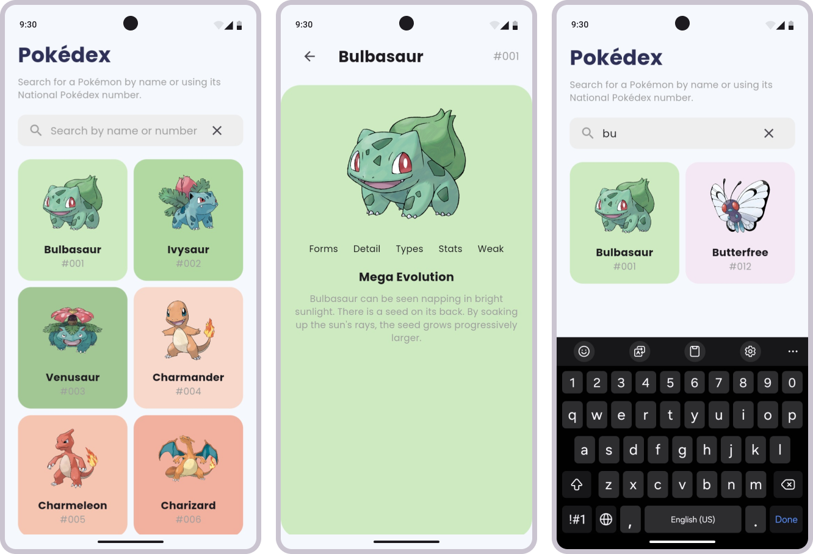

# Pokédex Flutter App

This directory contains source code for the cross-platform Pokédex Flutter app. Mainly targeted for Android and iOS devices.

## Features

- Search for Pokémon by name or ID
- View Pokémons in a grid view
- View Pokémon details

## Screenshots

